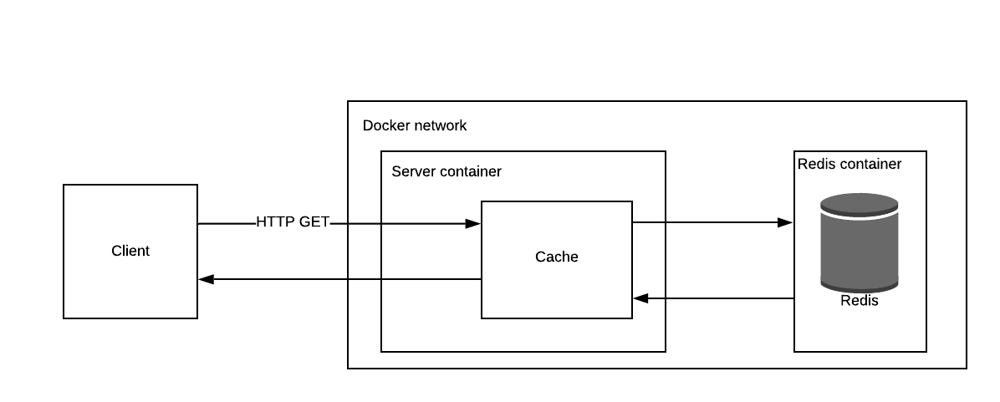

# Redis Proxy

## High-level architecture overview.


## What the code does.
This service creates a cache with a single backing Redis instance. Connecting to the cache is done via HTTP.

## Components

### Server
The server uses the Express framework to handle HTTP requests. Upon receiving a request, it checks the cache for the specified key, and if not found, check in Redis. If the item is also not found in Redis, it returns not found to the client.
Clients make requests via the `/id/:key` route. 
Keys and values are strings.

### Cache
The cache implements a doubly linked list and JS Object for lookups. I used an npm package at first but then decided to try to implement it myself. This led to research into doubly linked lists and hash tables. The max capacity and TTL are configured in the `.env` file and default to 100 items and 1 second.

Retrieval from the cache moves an item to the head of the list if it is not expired. Adding an item to the cache also puts it at the head of the list. If when adding an item the capacity is reached, the tail of the list is removed. Items that are expired are removed once they are retrived and the retrieval will return undefined indicating that the proxy will need to check Redis for the item.

### Redis
The Redis backing instance has methods for get, set and quit. On get, it will retrieve a single string value for a key. If the item is not found, it returns null and the proxy returns a 404. 

## Algorithm complexity of the cache operations.
Get: O(1) - key/values are stored in a JS Object which has constant time complexity for retrievals.
Set: O(1) - Entries are always stored at the head of the list.
Delete: O(1) - When the max capacity is hit, the tail of the list is dropped. For deletions when the item is expired, that node's neighbors are updated to point at each other.

## Running and testing
To run tests: `make test`
To run a development environment: `make dev`
To build: `make build`

Optionally, update the `.env` file
```
PORT (default: 3000)
REDIS_PORT (default: 6379)
CACHE_EXPIRY (default: 1000)
CACHE_CAPACITY (default: 500)
```

## How long you spent on each part of the project.
* HTTP web service: 1 hour
* Single backing instance: 2 hours
* Cached GET, Global expiry, LRU eviction, Fixed key size: 4 hours - learning and research into hash tables, doubly linked lists and algorithm complexity
* Configuration: 30 minutes
* System tests: 2 hours
* Platform: 5 hours - took some time getting familiar with Docker, in particular multiple docker containers with the proxy and Redis
* Single-click build and test: 1 hour
* Documentation: 2 hours
* General research, learning and implementing new tools/concepts, etc. 6 hours

## A list of the requirements that you did not implement and the reasons for omitting them.
* Sequential concurrent processing: handled by node by default